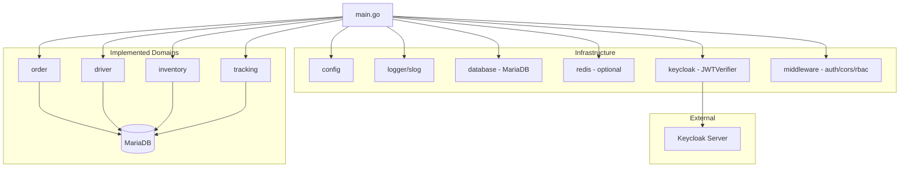
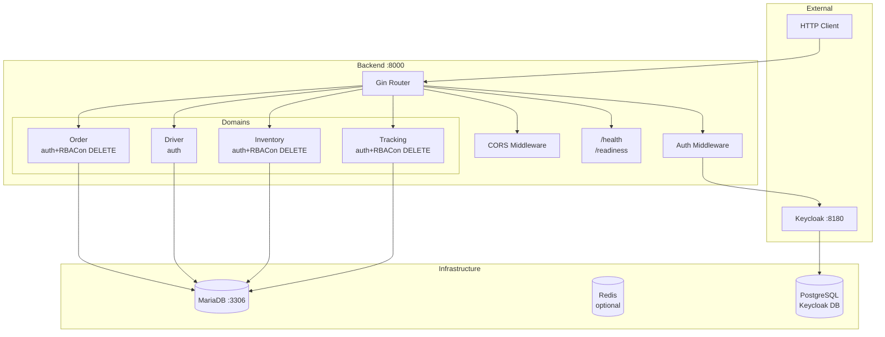

# Smart Logistic Project — Architecture

*Audit date: 2026-08-08. Based exclusively on actual source code, imports, and configuration. No source code was modified.*

---

## 1. Project Overview

**Goal**: A Smart Logistics Hub simulating warehouse operations and delivery management (modeled after Shopee Express / SPX). Built as a learning vehicle for Go backend development, microservices architecture, and production-oriented system design.

**Current state**: The project is a **modular monolith** in Go. The primary database is MariaDB. The README is **outdated** — it describes the original Python/FastAPI + MongoDB architecture which no longer exists in `backend/`.

**Build status**: `go build ./cmd/api/`, `go vet ./...`, and `go fmt ./...` all pass.

**Key technologies in actual use**:

| Technology | Usage |
|---|---|
| **Go 1.26.4** | Backend language |
| **Gin v1.12** | HTTP framework |
| **MariaDB 11** | Primary relational database (`database/sql` + `go-sql-driver/mysql`) |
| **Redis v9** | Optional cache/session store (`go-redis/v9`) |
| **Keycloak** | Authentication (JWT via RS256) |
| **AWS S3** | Optional object storage (not used by business logic) |
| **Docker Compose** | Local dev infrastructure (MariaDB, Keycloak, backend) |

---

## 2. Repository Structure

```
smart-logistic-project/
├── .env.development              # Dev env vars (MariaDB, Keycloak, Redis disabled)
├── .env.production               # Empty
├── .github/workflows/ci.yml      # Go CI: gofmt, vet, test (with MariaDB), build
├── .vscode/settings.json         # Python env manager (unrelated to backend)
├── docker-compose.yml            # MariaDB + Backend + Keycloak + Postgres
├── README.md                     # Outdated — describes old Python/MongoDB architecture
├── ARCHITECTURE.md               # This document
├── agents/                       # AI-assisted code migration tooling (NOT runtime)
│   ├── core/                     # base_agent.py (empty), llm_client.py (empty)
│   ├── skills/                   # skill_convert_fastapi_to_go.md (80-line spec), db_query_tool.py (empty), web_search_tool.py (empty)
│   └── workflows/                # code_migration_flow.py (empty)
├── ai_service/                   # Stub — ALL 4 files empty
│   ├── .env, .env.example, main.py, requirements.txt
│   └── model/                    # Empty directory
├── data_pipeline/                # Stub — directories exist, no files
│   ├── dags/                     # Empty
│   └── spark_jobs/               # Empty
├── prompts/                      # Task/prompt templates
│   ├── architecture_audit.md
│   └── architecture-refactor.md
└── backend/
    ├── .env                      # Empty
    ├── .env.example              # Template: MariaDB, Redis, S3, Keycloak, server, metrics, AUTO_MIGRATE
    ├── Dockerfile                # Multi-stage Go build (golang:1.26-alpine → alpine:3.20)
    ├── docker-entrypoint.sh      # Runs /migrate up (unless AUTO_MIGRATE=false) then execs /server
    ├── go.mod / go.sum
    ├── cmd/api/main.go           # Application entry point (API + metrics server)
    ├── cmd/migrate/main.go       # golang-migrate CLI (up / down / version)
    ├── migrations/
    │   ├── 000001_initial_schema.up.sql    # 13 tables (golang-migrate format)
    │   └── 000001_initial_schema.down.sql  # Drop all tables
    └── internal/
        ├── common/
        │   └── errors/errors.go  # APIError struct + 6 sentinel errors
        ├── infrastructure/
        │   ├── config/config.go          # Env-based config loading (incl. metrics)
        │   ├── database/mariadb.go       # MariaDB connection + pool
        │   ├── redis/client.go           # Redis client factory
        │   ├── keycloak/verifier.go      # JWTVerifier with JWKS + RSA
        │   ├── middleware/auth.go        # JWT auth middleware (accepts verifier interface)
        │   ├── middleware/cors.go        # CORS middleware
        │   ├── middleware/rbac.go        # RequireRole middleware
        │   ├── middleware/error_handler.go  # Centralized error rendering (c.Error)
        │   ├── middleware/request_id.go  # Request ID middleware + request-scoped logger
        │   ├── middleware/metrics.go     # Prometheus HTTP metrics middleware
        │   └── logger/logger.go         # slog wrapper
        ├── driver/                       # FULLY IMPLEMENTED
        ├── order/                        # FULLY IMPLEMENTED
        ├── inventory/                    # FULLY IMPLEMENTED
        ├── tracking/                     # FULLY IMPLEMENTED
        ├── ai/                           # Entity/DTO only (SQL db tags, planned)
        ├── billing/                      # Entity/DTO only (SQL db tags, planned)
        ├── inbound/                      # Entity/DTO only (SQL db tags, planned)
        ├── product/                      # Entity/DTO only (SQL db tags, planned)
        ├── trip/                         # Entity/DTO only (SQL db tags, planned)
        └── warehouse/                    # Entity/DTO only (SQL db tags, planned)
```

---

## 3. System Components

### 3.1 Backend (`backend/`)

| Field | Detail |
|---|---|
| **Responsibility** | REST API for logistics operations |
| **Language** | Go 1.26.4 |
| **Module** | `my-web-app.com/smart-logistic-hub` |
| **HTTP Framework** | Gin v1.12.0 |
| **Entry Point** | `backend/cmd/api/main.go` — `func main()` |
| **Primary Database** | MariaDB 11 (`database/sql` + `go-sql-driver/mysql v1.10.0`) |
| **Optional Infrastructure** | Redis v9.20.1, AWS S3 (v1.42), Keycloak |
| **Architectural Style** | **Modular monolith** — domain-first, dependency injection |
| **Dockerfile** | Multi-stage (golang:1.24-alpine → alpine:3.21, non-root user, healthcheck) |
| **Compiles?** | **Yes** — `go build`, `go vet`, `go fmt` all pass |

### 3.2 AI Service (`ai_service/`)

| Field | Detail |
|---|---|
| **Current State** | **EMPTY** — `main.py`, `requirements.txt`, `.env.example`, `model/` all 0 bytes |
| **Status** | STUB — not implemented |

### 3.3 Data Pipeline (`data_pipeline/`)

| Field | Detail |
|---|---|
| **Current State** | **EMPTY** — `dags/` and `spark_jobs/` contain no files |
| **Status** | STUB — not implemented |

### 3.4 Agents (`agents/`)

| Field | Detail |
|---|---|
| **Responsibility** | AI-assisted code migration tooling (Python → Go) |
| **Content** | 1 markdown spec (`skill_convert_fastapi_to_go.md`), 5 empty Python stubs |
| **Runtime Component?** | **No** — development tooling only |
| **Status** | STUB — incomplete tooling |

---

## 4. Backend Architecture

### 4.1 Entry Point — `backend/cmd/api/main.go`

```
package main
```

The entry point performs bootstrap in order:

1. `config.LoadConfig()` — loads env vars from `.env.{APP_ENV}`, returns `*Config`
2. `logger.New(cfg.Environment)` — creates structured `*slog.Logger`, sets as default
3. `database.Connect(cfg)` — opens MariaDB connection (25 max open, 5 idle, 5min lifetime), pings
4. `infraredis.NewRedisClient(ctx, cfg)` — optional Redis (only if `REDIS_ENABLED`)
5. `keycloak.NewJWTVerifier(cfg)` — creates JWT verifier with JWKS support
6. `middleware.AuthMiddleware(cfg, devSkipAuth, verifier)` — JWT auth middleware
7. `middleware.CORSMiddleware(frontendURL)` — CORS middleware
8. Gin router setup:
   - Global middleware chain: `RequestIDMiddleware()` → `gin.Recovery()` → CORS → `MetricsMiddleware()` → `ErrorHandler()`
   - `/healthz` — public liveness, returns 200 while the process is alive (no DB check)
   - `/readyz` — public readiness, pings MariaDB (503 when DB unreachable)
   - `/api/v1/orders/*` — auth-protected CRUD (admin-only DELETE)
   - `/api/v1/drivers/*` — auth-protected CRUD
   - `/api/v1/inventory/*` — auth-protected CRUD (admin-only DELETE)
   - `/api/v1/tracking-logs/*` — auth-protected CRUD (admin-only DELETE)
9. Optional internal Prometheus metrics server on a separate port (`METRICS_PORT`, default 9090, controlled by `METRICS_ENABLED`) serving `/metrics`
10. HTTP server with graceful shutdown (SIGINT/SIGTERM, 10s drain); both API and metrics servers are shut down cleanly

**Dependency injection**: All dependencies wired manually in `main()` — no framework used.

### 4.2 Domain Implementation Status

| Domain | Entity | DTO | Handler | Service | Repository | Routes | Auth | DB | Status |
|---|---|---|---|---|---|---|---|---|---|
| **driver** | ✓ | ✓ | ✓ | ✓ | ✓ (MariaDB) | ✓ | AuthMw | MariaDB | **FULL** |
| **order** | ✓ | ✓ | ✓ | ✓ | ✓ (MariaDB) | ✓ | AuthMw + RBAC | MariaDB | **FULL** |
| **inventory** | ✓ | ✓ | ✓ | ✓ | ✓ (MariaDB) | ✓ | None | MariaDB | **FULL** |
| **tracking** | ✓ | ✓ | ✓ | ✓ | ✓ (MariaDB) | ✓ | None | MariaDB | **FULL** |
| **ai** | ✓(bson) | ✓ | — | — | — | — | — | — | ENTITY/DTO |
| **billing** | ✓(bson) | ✓ | — | — | — | — | — | — | ENTITY/DTO |
| **inbound** | ✓(bson) | ✓ | — | — | — | — | — | — | ENTITY/DTO |
| **product** | ✓(bson) | ✓ | — | — | — | — | — | — | ENTITY/DTO |
| **trip** | ✓(bson) | ✓ | — | — | — | — | — | — | ENTITY/DTO |
| **warehouse** | ✓(bson) | ✓ | — | — | — | — | — | — | ENTITY/DTO |
| **auth** | — | — | stub(1 line) | — | — | — | — | — | STUB |

### 4.3 Domain Architecture Patterns

**All implemented domains** (driver, order, inventory, tracking) follow the same subdirectory structure:

```
internal/{domain}/
├── entity/{entity}.go
├── dto/request.go, dto/response.go
├── handler/handler.go
├── service/service.go, service_test.go
├── repository/mariadb.go
└── routes.go
```

Pattern:
```
Handler (Gin context → typed DTO binding → calls service)
  ↓
Service (business logic, validation, use-case orchestration)
  ↓
Repository (SQL queries via database/sql)
  ↓
MariaDB
```

### 4.4 Stub Domains (Entity/DTO Only)

The domains `ai`, `billing`, `inbound`, `product`, `trip`, `warehouse` contain only entity and DTO definitions with MariaDB-compatible `db` struct tags matching the migration schema. No handler, service, or repository implementations exist yet. These represent **planned** business capabilities with corresponding tables already in the MariaDB schema.

---

## 5. Infrastructure

### 5.1 Config (`internal/infrastructure/config/`)

- **File**: `config.go` — `package config`
- **Exports**: `type Config struct` (31 fields), `func LoadConfig() *Config`
- **No global variable** — `LoadConfig()` returns `*Config`, passed via DI
- **Loading**: `.env.{APP_ENV}` via `godotenv`, OS env fallback
- **Fields**: ProjectName, Version, Environment, ServerHost/Port, S3 (enabled/region/bucket/endpoint/pathstyle), Redis (enabled/URI/host/port/password/DB/ttl), MariaDB (enabled/host/port/user/password/name/URI), FrontendURL, AIServiceURL, KeycloakServerURL/Realm/ClientID, DevSkipAuth

### 5.2 Database — MariaDB (`internal/infrastructure/database/`)

- **File**: `mariadb.go` — `package database`
- **Exports**: `func Connect(cfg *config.Config) (*sql.DB, error)`, `func Close(db *sql.DB)`
- **Driver**: `github.com/go-sql-driver/mysql` (imported via blank import)
- **Pool**: MaxOpenConns=25, MaxIdleConns=5, ConnMaxLifetime=5min
- **Connection**: Supports `MARIADB_URI` (full DSN) or individual host/port/user/password/name fields
- **Startup validation**: Pings DB on `Connect()`

### 5.3 Redis (`internal/infrastructure/redis/`)

- **File**: `client.go` — `package redis`
- **Exports**: `func NewRedisClient(ctx, cfg) (*redis.Client, error)`
- **Conditional**: Only connects if `REDIS_ENABLED=true`
- **URI or fields**: Supports `REDIS_URI` (parsed) or individual host/port/password/DB
- **Usage**: Client created in `main.go` but **not currently used** by any business logic

### 5.4 Keycloak / Authentication (`internal/infrastructure/keycloak/`)

**Two files exist, one is orphaned:**

| File | Package | Used? | Purpose |
|---|---|---|---|
| `verifier.go` | `keycloak` | **Yes** (imported by main.go) | `JWTVerifier` struct with JWKS fetching, RSA key parsing, RS256 token verification with issuer validation |
| `client.go` | `keycloak` | **No** (orphaned) | Package-level `FetchJWKS()` function — never called |

**JWTVerifier** (`verifier.go`):
- `func NewJWTVerifier(cfg *config.Config) *JWTVerifier`
- `func (v *JWTVerifier) VerifyToken(ctx, tokenString) (jwt.MapClaims, error)`:
  - Parses RS256 JWT
  - Validates issuer: `{KeycloakServerURL}/realms/{KeycloakRealm}`
  - Fetches JWKS from Keycloak `/certs` endpoint
  - Caches JWKS in-memory with `sync.RWMutex`
  - Extracts RSA public key from `x5c` certificate chain
  - Returns parsed claims on success

### 5.5 Middleware (`internal/infrastructure/middleware/`)

| File | Exports | Description |
|---|---|---|
| `auth.go` | `type JWTVerifier interface`, `func AuthMiddleware(cfg, devSkipAuth, verifier) gin.HandlerFunc` | Bearer token extraction, dev mode mock user, JWT verification via interface |
| `cors.go` | `func CORSMiddleware(frontendURL string) gin.HandlerFunc` | CORS for configured frontend origin, common methods/headers, credentials, 12h max age |
| `rbac.go` | `func RequireRole(allowedRoles ...string) gin.HandlerFunc` | Extracts roles from JWT `realm_access.roles` and `resource_access.*.roles` |
| `error_handler.go` | `func ErrorHandler() gin.HandlerFunc` | Global error middleware registered via `r.Use(...)`. Renders errors recorded with `c.Error(err)` as `{ "error": { "code", "message" } }`, maps `*APIError` to its status code, masks unknown errors as generic 500 (logs detail server-side via the request-scoped logger) |
| `request_id.go` | `func RequestIDMiddleware() gin.HandlerFunc`, `func LoggerFromContext(c) *slog.Logger` | First middleware in the chain. Generates/reuses a request ID, sets gin `request_id`, attaches it to a request-scoped `slog` logger, and sets the `X-Request-ID` response header |
| `metrics.go` | `func MetricsMiddleware() gin.HandlerFunc` | Records `http_requests_total{method,path,status}` and `http_request_duration_seconds{method,path}` for every request |

### 5.6 Logger (`internal/infrastructure/logger/`)

- **File**: `logger.go` — `package logger`
- **Exports**: `func New(level string) *slog.Logger`, `func WithRequestID(logger, requestID) *slog.Logger`
- **Implementation**: Go standard library `log/slog` with JSON output to stdout
- **Levels**: debug, info, warn, error

---

## 6. API & Routing

### 6.1 Route Registration

Route registration follows a consistent pattern. Each domain exports a `RegisterRoutes` function called from `main.go`:

```go
order.RegisterRoutes(api, db, authMw)
driver.RegisterRoutes(api, db, authMw)
inventory.RegisterRoutes(api, db, authMw)
tracking.RegisterRoutes(api, db, authMw)
```

All four implemented domains receive the same `authMw` (JWT auth) parameter.

### 6.2 API Endpoints

| Method | Path | Auth | Role | Domain |
|---|---|---|---|---|
| GET | `/healthz` | Public | — | Global (liveness) |
| GET | `/readyz` | Public | — | Global (readiness) |
| GET | `/metrics` | Internal port | — | Global (Prometheus) |
| GET | `/api/v1/orders/health` | Public | — | Order |
| POST | `/api/v1/orders` | JWT | — | Order |
| GET | `/api/v1/orders` | JWT | — | Order |
| GET | `/api/v1/orders/:id` | JWT | — | Order |
| PUT | `/api/v1/orders/:id` | JWT | — | Order |
| DELETE | `/api/v1/orders/:id` | JWT | admin | Order |
| POST | `/api/v1/drivers` | JWT | — | Driver |
| GET | `/api/v1/drivers` | JWT | — | Driver |
| GET | `/api/v1/drivers/:id` | JWT | — | Driver |
| PUT | `/api/v1/drivers/:id` | JWT | — | Driver |
| DELETE | `/api/v1/drivers/:id` | JWT | — | Driver |
| POST | `/api/v1/inventory` | JWT | — | Inventory |
| GET | `/api/v1/inventory` | JWT | — | Inventory |
| GET | `/api/v1/inventory/:id` | JWT | — | Inventory |
| PATCH | `/api/v1/inventory/:id` | JWT | — | Inventory |
| DELETE | `/api/v1/inventory/:id` | JWT | admin | Inventory |
| POST | `/api/v1/tracking-logs` | JWT | — | Tracking |
| GET | `/api/v1/tracking-logs` | JWT | — | Tracking |
| GET | `/api/v1/tracking-logs/order/:order_code` | JWT | — | Tracking |
| GET | `/api/v1/tracking-logs/:id` | JWT | — | Tracking |
| PUT | `/api/v1/tracking-logs/:id` | JWT | — | Tracking |
| DELETE | `/api/v1/tracking-logs/:id` | JWT | admin | Tracking |

**Notable**: All CRUD routes across all four domains require a valid JWT. DELETE routes for `orders`, `inventory`, and `tracking-logs` additionally require the `admin` role via `RequireRole("admin")`. Only `/healthz`, `/readyz`, `/api/v1/orders/health` are public; `/metrics` is served on a separate internal port and is not part of the public API surface.

### 6.3 Inter-Service Communication

| Path | Status |
|---|---|
| Backend → AI Service | **N/A** — config has `AI_SERVICE_URL` but no HTTP calls exist |
| Backend → Data Pipeline | **N/A** — pipeline has no code |
| Backend → Keycloak | **Implemented** — JWKS fetching for JWT verification |
| Backend → Redis | **Connectable** — client created but not used by business logic |
| Backend → S3 | **Disabled** — no code uses S3 |
| Frontend → Backend | **Configured** — CORS allows `FRONTEND_URL` origin |

---

## 7. Database Architecture

### 7.1 MariaDB

**13 tables** defined in `migrations/000001_initial_schema.up.sql`:

| Table | Key Columns | Constraints | Used By |
|---|---|---|---|
| `warehouses` | id, warehouse_code, name, address, lat, lng, contact_phone, manager_name, is_active | UNIQUE(warehouse_code) | — |
| `products` | id, sku, name, category, price, weight_gram, dimensions | UNIQUE(sku) | — |
| `drivers` | id, driver_code, full_name, phone, vehicle_type, license_plate, status, current_lat/lng, warehouse_id | UNIQUE(driver_code), INDEX(status) | driver domain |
| `orders` | id, order_code, sender_*, receiver_*, status, assigned_driver_id | UNIQUE(order_code), INDEX(status, driver_id) | order domain |
| `order_items` | id, order_id, product_id, product_name, quantity, weight_gram | FK→orders ON DELETE CASCADE | order domain |
| `inventory` | id, product_id, warehouse_id, available_qty, reserved_qty, damaged_qty, hold_qty | UNIQUE(product_id, warehouse_id), INDEXES | inventory domain |
| `trips` | id, trip_code, driver_id, vehicle_license_plate, status, distance, duration | UNIQUE(trip_code), INDEX(driver_id) | — |
| `trip_stops` | id, trip_id, order_code, stop_type, address, lat, lng, status, timestamps | FK→trips ON DELETE CASCADE | — |
| `tracking_events` | id, order_code, driver_code, status_update, lat, lng, note, timestamp | INDEX(order_code, driver_code, timestamp) | tracking domain |
| `billing` | id, billing_code, order_code, amount, currency, payment_method/status | UNIQUE(billing_code), INDEX(order_code) | — |
| `inbounds` | id, receipt_code, supplier_name, status | UNIQUE(receipt_code) | — |
| `inbound_items` | id, inbound_id, product_id, expected/received/rejected/qc_passed qty | FK→inbounds ON DELETE CASCADE | — |
| `ai_events` | id, event_code, license_plate, confidence_score, event_type, gate_id | UNIQUE(event_code) | — |

**All tables**: InnoDB engine, utf8mb4 charset, timestamps with CURRENT_TIMESTAMP defaults.

**Migration tool**: **golang-migrate** (`github.com/golang-migrate/migrate/v4` with the mysql driver and file source). Migration files follow golang-migrate convention (`{version}_{description}.up.sql` / `.down.sql`, e.g. `000001_initial_schema.up.sql`). A dedicated CLI at `backend/cmd/migrate/main.go` supports `up`, `down`, and `version` subcommands, reading the same `MARIADB_*` env vars as the app.

**Migration strategy — explicit CLI, not auto-run:**

| Context | `AUTO_MIGRATE` | Who runs migration | Rationale |
|---|---|---|---|
| **docker-compose.yml** (default) | `false` | Manual: `docker compose exec backend /migrate up` | Production-like safety — no surprise schema changes on restart. The separate `cmd/migrate` CLI was chosen precisely to decouple migration from server startup. |
| **docker-compose.override.yml** (dev convenience) | `true` (override) | `docker-entrypoint.sh` auto-runs on container start | Developer convenience — migration runs automatically so `docker compose up -d` just works. |
| **CI workflow** (`.github/workflows/ci.yml`) | N/A | Explicit `go run ./cmd/migrate up` step before `go test` | CI always runs migrations explicitly via the CLI, independent of `AUTO_MIGRATE`. |
| **`test/integration/setup_test.go`** | N/A | Applies raw SQL directly (down + up) as part of `TestMain` | Self-contained for hermetic tests — does not depend on golang-migrate versioning. |

The `docker-entrypoint.sh` script gates behind `AUTO_MIGRATE={true|false}`. Because golang-migrate uses MySQL advisory locks (`GET_LOCK`), concurrent startup of multiple replicas with `AUTO_MIGRATE=true` would not race — but the explicit `false` default in compose ensures migration intent is always deliberate outside of dev/CI.

### 7.2 MongoDB (Removed)

MongoDB is **no longer the primary database**. The `go.mongodb.org/mongo-driver/v2` remains in `go.mod` as an **indirect** dependency (transitive through another package). No Go code references MongoDB. All repositories use MariaDB. All entity structs in stub domains have been migrated to MariaDB-compatible `db` struct tags.

---

## 8. Dependency Flow

### 8.1 Runtime Dependency Graph

```
main.go
├── config.LoadConfig()
├── logger.New()
├── database.Connect()        → MariaDB
├── redis.NewRedisClient()    → Redis (optional)
├── keycloak.NewJWTVerifier() → Keycloak (JWKS)
├── middleware
│   ├── CORSMiddleware()
│   └── AuthMiddleware()     → JWTVerifier interface
├── domain routes
│   ├── order.RegisterRoutes()
│   │   └── handler → service → repository → MariaDB
│   ├── driver.RegisterRoutes()
│   │   └── handler → service → repository → MariaDB
│   ├── inventory.RegisterRoutes()
│   │   └── handler → service → repository → MariaDB
│   └── tracking.RegisterRoutes()
│       └── handler → service → repository → MariaDB
└── health/readiness         → MariaDB ping
```

### 8.2 Mermaid Diagram



### 8.3 Concrete Import Analysis

Verified by inspecting actual `import` statements:

| Package | Imported By |
|---|---|
| `internal/infrastructure/config` | main.go, database, redis, keycloak, middleware/auth |
| `internal/infrastructure/database` | main.go |
| `internal/infrastructure/redis` | main.go |
| `internal/infrastructure/keycloak` | main.go (verifier.go only; client.go is orphaned) |
| `internal/infrastructure/middleware` | main.go, order/handler |
| `internal/infrastructure/logger` | main.go |
| `internal/common/errors` | driver/repository, order/repository, inventory/repository, tracking/repository |
| `internal/driver/{handler,service,repository,dto,entity}` | driver/routes.go, handler, service, repository (internal to domain) |
| `internal/order/{handler,service,repository,dto,entity}` | order/routes.go, handler, service, repository (internal to domain) |

**No circular dependencies detected.**

---

## 9. Configuration

### 9.1 Environment Files

| File | Status | Contents |
|---|---|---|
| `backend/.env.example` | Template | MariaDB, Redis, S3, Keycloak, server settings. No real secrets. |
| `backend/.env` | Empty | — |
| `.env.development` (root) | In use | MariaDB localhost, Redis disabled, Keycloak, DEV_SKIP_AUTH=true |
| `.env.production` (root) | Empty | — |

### 9.2 Configuration Loading

`config.LoadConfig()` in `internal/infrastructure/config/config.go`:
1. Reads `APP_ENV` (default: `development`)
2. Loads `.env.{APP_ENV}` via `godotenv`
3. Falls back to OS environment variables
4. Returns `*Config` — **no global state**

### 9.3 Secrets Handling

- `.env.development` uses localhost credentials only (no secrets exposed)
- `.env.example` uses placeholder values (`root`, `localhost`)
- `docker-compose.yml` credentials are development-only defaults
- No real cloud credentials found in the repository

---

## 10. Error Handling

- **Shared errors**: `internal/common/errors/errors.go` (`package errors`)
  - `APIError{StatusCode, Message}` with `Error()` method
  - Sentinel errors: `ErrBadRequest` (400), `ErrUnauthorized` (401), `ErrForbidden` (403), `ErrNotFound` (404), `ErrConflict` (409), `ErrInternal` (500)
- **Repository errors**: Return `apierrors.ErrNotFound` for `sql.ErrNoRows`, wrap DB errors with `fmt.Errorf`
- **Service errors**: Propagate repository errors, add business validation
- **Centralized error middleware**: `internal/infrastructure/middleware/error_handler.go` registers a global `ErrorHandler()` middleware (`r.Use(...)`). Handlers record errors via `c.Error(err)` and return; the middleware:
  - Extracts `*APIError` from the error chain via `errors.As` and renders `{ "error": { "code": <status>, "message": "<msg>" } }`
  - Falls back to HTTP 500 with a generic `"Internal server error"` message for unknown errors — the underlying error is only logged server-side via `slog`, never leaked to the client
  - Binding/validation errors are wrapped with `ErrBadRequest` by handlers before being passed to `c.Error`
- **No per-handler `resolveError()` helper remains**: all four implemented domains (driver, order, inventory, tracking) use `c.Error(err)` + the global middleware

---

## 11. Observability

| Capability | Status |
|---|---|
| Structured logging | **Yes** — `log/slog` with JSON output, configurable levels |
| Request ID | **Yes** — `RequestIDMiddleware()` (first in the chain) generates/reuses a request ID, stores it in gin context, attaches it to a request-scoped slog logger (`request_id` field), and echoes `X-Request-ID` in the response header |
| Health check (liveness) | **Yes** — `GET /healthz` returns 200 while the process is alive; no DB dependency |
| Readiness check | **Yes** — `GET /readyz` pings MariaDB, returns 503 when DB is unreachable |
| Tracing | **No** |
| Metrics | **Yes** — Prometheus (`prometheus/client_golang`), exposed on a **separate internal port** (`METRICS_PORT`, default 9090) via `promhttp.Handler()`, not on the public API port |
| Prometheus / Grafana | Prometheus client library only; no Grafana setup |
| Error monitoring | **No** |

**HTTP metrics** (`internal/infrastructure/middleware/metrics.go`, applied globally):
- `http_requests_total{method,path,status}` — request counter (5xx errors are derivable from the `status` label)
- `http_request_duration_seconds{method,path}` — request latency histogram

The metrics server is started alongside the API server in `cmd/api/main.go` and shuts down gracefully with it. `METRICS_ENABLED` (default `true`) controls whether it starts.

---

## 12. Testing

| Artifact | Status |
|---|---|
| Service unit tests | **Implemented** — `driver/service/service_test.go`, `order/service/service_test.go`, `inventory/service_test.go`, `tracking/service_test.go` |
| Middleware tests | **Implemented** — `infrastructure/middleware/error_handler_test.go`, `infrastructure/middleware/request_id_test.go` |
| Repository integration tests | **Implemented** — `test/integration/` (driver, order, inventory, tracking) |
| Migration CLI | `cmd/migrate` — verified locally (`up`/`down`/`version` round-trip against real MariaDB) |
| E2E tests | **None** |
| Test database | **MariaDB** — real database via `MARIADB_*` env vars (CI provides a MariaDB service container) |

**Service unit tests** use mocked repositories (consumer-side interfaces `DriverRepository`, `OrderRepository`, `InventoryRepository`, `TrackingRepository` defined in each service package). Mock repositories implement these interfaces and are injected via `NewServiceWithRepo(...)` — no real DB is touched.

**Repository integration tests** in `test/integration/` run against a real MariaDB. `TestMain` connects using `MARIADB_HOST/PORT/USER/PASSWORD/DB_NAME` env vars (defaults: localhost/3306/root/root/smart_logistics), resets the schema via the down/up migration files, and each test truncates tables for isolation. They verify CRUD for all four repositories plus `sql.ErrNoRows` → `ErrNotFound` behavior.

**CI**: `.github/workflows/ci.yml` runs `go run ./cmd/migrate up` (applying the schema) then `go test ./...` with a MariaDB 11 service container, so integration tests execute in CI against the migrated schema.

---

## 13. Deployment

### 13.1 Docker

| Component | File | Status |
|---|---|---|
| Backend | `backend/Dockerfile` | **Implemented** — multi-stage (golang:1.26-alpine builder → alpine:3.20 runtime), builds `/server` (cmd/api) + `/migrate` (cmd/migrate), non-root user, `HEALTHCHECK` against `/healthz` |
| Backend entrypoint | `backend/docker-entrypoint.sh` | Runs `/migrate up` before starting `/server` (skippable via `AUTO_MIGRATE=false`) |
| AI Service | None | — |
| Data Pipeline | None | — |

### 13.2 Docker Compose

`docker-compose.yml` defines 4 services + 1 network:

1. **mariadb** — MariaDB 11, host port 3307 → container 3306, healthcheck enabled
2. **backend** — Go app, builds from `./backend/Dockerfile`, ports 8000 (API) + 9090 (metrics), `AUTO_MIGRATE=true`, depends on healthy mariadb + started keycloak
3. **postgres-keycloak** — PostgreSQL 16 for Keycloak
4. **keycloak** — Keycloak latest (dev mode), host port 8180 → 8080

### 13.3 CI/CD (`.github/workflows/ci.yml`)

- **Triggers**: Push/PR to `main`/`master`
- **Working directory**: `backend/`
- **Service**: MariaDB 11 container
- **Steps**:
  1. Checkout
  2. Set up Go 1.24
  3. `gofmt` format check
  4. `go vet ./...`
  5. `go run ./cmd/migrate up` (applies migrations before tests)
  6. `go test ./...` (with MariaDB env vars)
  7. `go build ./cmd/api/`

### 13.4 Independent Deployability

| Component | Independently Deployable? |
|---|---|
| Backend | **Yes** — Dockerfile + docker-compose |
| AI Service | **No** — no code |
| Data Pipeline | **No** — no code |
| Keycloak | **Yes** — via Docker Compose |
| MariaDB | **Yes** — via Docker Compose |

---

## 14. Orphaned / Dead Code

**Cleared in Phase 3.** The previously orphaned files (`pkg/utils/logger.go`, `keycloak/client.go`, `auth/handler/auth_handler.go`) have been removed after confirming zero imports via grep across the entire codebase. The empty `pkg/` and `auth/` directories were also removed.

---

## 15. Architectural Observations

### 15.1 Structural Inconsistencies

1. ~~**Dual file structure styles**~~ — **Resolved.** All four implemented domains now use the same subdirectory layout (entity/, dto/, handler/, service/, repository/ + routes.go at root).

2. ~~**Unused bson tags**~~ — **Resolved.** All 6 stub domains (ai, billing, inbound, product, trip, warehouse) have been migrated from `bson` struct tags to MariaDB-compatible `db` struct tags matching the migration schema.

3. ~~**Orphaned packages**~~ — **Resolved.** `pkg/utils/`, `infrastructure/keycloak/client.go`, and `auth/` have been removed.

4. **Service constructor asymmetry**: `driver`/`order` use `NewService(db)` + `NewServiceWithRepo(repo)`; `inventory`/`tracking` use `NewService(repo)` + `NewServiceWithRepo(repo)`. The `NewServiceWithRepo` variants exist to enable repository mocking in unit tests.

### 15.2 Dependency Direction

Correct direction maintained:
```
Handler → Service → Repository → MariaDB
Infrastructure (config, database, redis, keycloak, middleware)
```
No circular dependencies. Infrastructure packages do not import domain packages.

### 15.3 Microservice Readiness

The modular monolith structure supports future extraction:
- Each domain has clear boundaries (entity, service, repository)
- No cross-domain database access in current code
- No cross-domain service calls in current code
- Domains could be extracted into separate services with database per service

---

## 16. Current Architecture Diagram



---

## 17. Summary

| Metric | Value |
|---|---|
| Total Go files | 78 (67 source + 11 test) |
| Fully implemented domains | 4 (driver, order, inventory, tracking) — all consistent subdirectory structure |
| Stub domains (entity/DTO only) | 6 (ai, billing, inbound, product, trip, warehouse) — all migrated to SQL db tags |
| Broken stub (1 line) | 0 (auth/ removed) |
| MariaDB tables | 13 (in migration via golang-migrate) |
| API endpoints | 23 (plus /healthz, /readyz; /metrics on internal port) |
| External services used | Keycloak (active), Redis (optional), S3 (optional, disabled) |
| Orphaned files | 0 (all confirmed dead code removed in Phase 3) |
| Empty stubs (`ai_service/`) | 4 files |
| Empty stubs (`data_pipeline/`) | 2 directories |
| Build status | `go build`, `go vet`, `go fmt` — all **pass** |
| Test status | **Implemented** — 4 service unit test suites (mocked repos), 2 middleware test suites (error handler + request ID), 12 repository integration tests (real MariaDB) |

*Audit completed: 2026-08-08. Based exclusively on actual source code verification. No files modified.*
